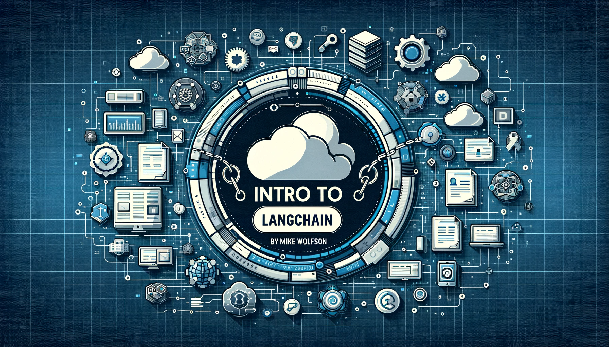

# Introduction to Langchain

Links and resources to support [Phoenix AI Developer Meetup](https://www.meetup.com/phx-ai-devs/events/298473066/) presentation about [LangChain](https://github.com/langchain-ai)

## Slides

[Google Slides](https://docs.google.com/presentation/d/1aISvReEOqPJUQriy9bBJnHixW6N16W41GnuhoDzzjXo/edit?usp=sharing)

## Jupyter Notebook 

[Demo Notebook Used in Presentation](./langchainPAID.ipynb)

## Deep Learning AI Short Courses

I can't recommend these short courses enough. They are a great way to use the LangChain and thanks to their included development environment, you don't need to even local developer tools to complete the courses.  Both of these courses are free.

[DeepLearning.ai - LangChain Short Course](https://learn.deeplearning.ai/langchain) 
[DeepLearning.ai - Build LLM Apps with LangChain.js](https://learn.deeplearning.ai/build-llm-apps-with-langchain-js)

## LangChain on Github
[LangChain Github](https://github.com/langchain-ai)

## Phoenix AI Developers Meetup

<table>
  <tr>
    <td>
      <!-- Image -->
      
    </td>
    <td>
      <!-- Text -->
      <b>Phoenix AI Developers Meetup</b> 
      Occurs on the last Wednesday of every month 
      <a href="https://www.meetup.com/phx-ai-devs">Register on Meetup</a>
    </td>
  </tr>
</table>

